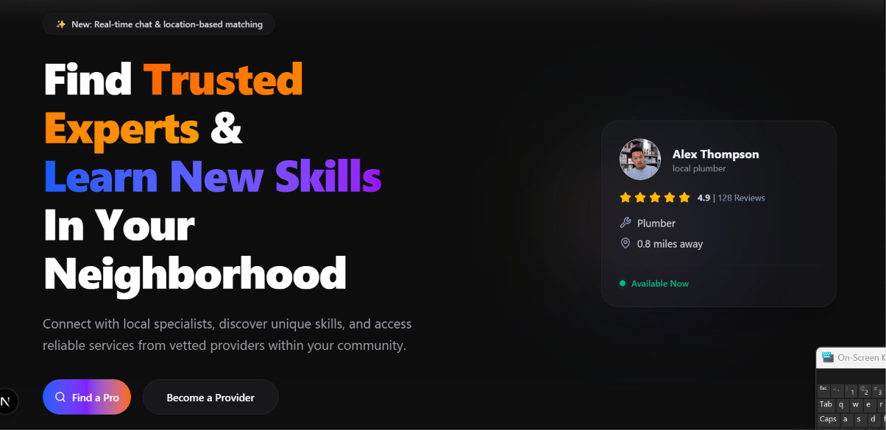
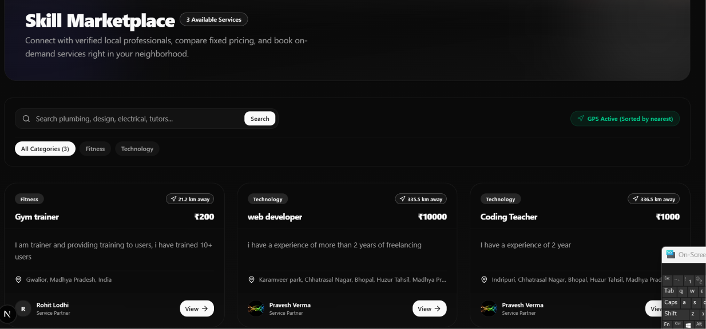
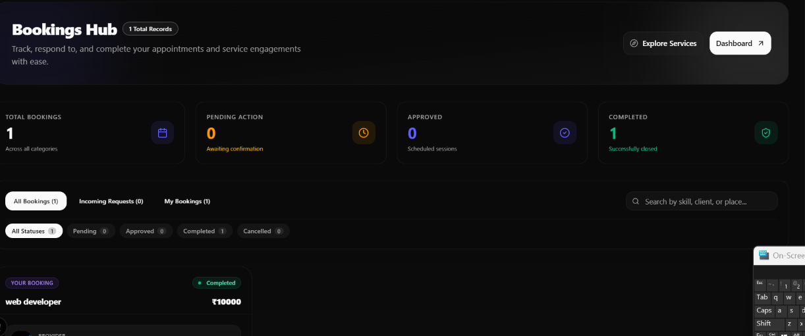
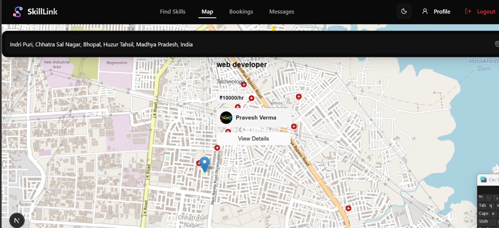

<div align="center">

# 🔗 SkillLink

**Connect with verified local professionals — search, book, chat, and review — all sorted by proximity.**

[](https://nextjs.org/)
[](https://react.dev/)
[](https://supabase.com/)
[](https://upstash.com/)
[](https://typescriptlang.org/)
[](https://tailwindcss.com/)
[](https://leafletjs.com/)

---



[Live Demo →](https://skill-link-five-ruby.vercel.app) · [Report Bug](https://github.com/Praveshvermaa/SkillLink/issues) · [Request Feature](https://github.com/Praveshvermaa/SkillLink/issues)

</div>

---

## 📖 Table of Contents

- [Overview](#-overview)
- [Key Features](#-key-features)
- [Tech Stack](#-tech-stack)
- [Architecture](#-architecture)
- [Getting Started](#-getting-started)
- [Environment Variables](#-environment-variables)
- [Database Schema](#-database-schema)
- [API Endpoints & Server Actions](#-api-endpoints--server-actions)
- [Folder Structure](#-folder-structure)
- [Screenshots](#-screenshots)
- [Contributing](#-contributing)
- [License](#-license)
- [Contact](#-contact)

---

## 🧭 Overview

SkillLink is a hyperlocal service marketplace that connects users with verified service providers in their neighborhood. Providers list their skills (plumbing, tutoring, design, etc.) with fixed pricing and geolocation, while users discover them on a map or search feed — sorted by physical proximity using GPS. Built-in real-time chat, booking management, and a review system complete the end-to-end workflow from discovery to post-service feedback.

---

## ✨ Key Features

- **GPS-Sorted Discovery** — Skills are ranked by distance from the user's live location via a PostGIS-powered Supabase RPC, not just basic text search.
- **Interactive Map View** — Leaflet-based map renders provider pins within the visible viewport bounds, fetched dynamically as the user pans/zooms.
- **Real-Time Chat** — Supabase Realtime powers instant messaging between users and providers with read receipts.
- **Booking Lifecycle** — Full `pending → approved → completed → rejected` status flow, managed by the provider with server-validated transitions.
- **Post-Completion Reviews** — Users can rate (1–5 stars) and review only after a booking is marked as completed, enforced at the server action level with Zod validation.
- **Role-Based Access** — Three roles (`user`, `provider`, `admin`) gate features like skill listing, booking approval, and admin dashboards via Supabase RLS policies and middleware.
- **Redis Caching** — Upstash Redis caches skill listings with TTL-based expiry and automatic invalidation on write operations for sub-100ms page loads.
- **Email Verification Flow** — Full auth lifecycle including signup with email confirmation, password reset, and verification resend via Supabase Auth.
- **Dark Mode** — System-aware theme toggle with `next-themes` and smooth transitions.
- **Location Autocomplete** — Address input with geocoding for both user profiles and skill listings.

---

## 🛠 Tech Stack

| Layer | Technology |
|---|---|
| **Framework** | Next.js 16 (App Router, React Server Components, Server Actions) |
| **Language** | TypeScript 5 |
| **UI** | React 19, Tailwind CSS 4, Radix UI primitives, shadcn/ui components |
| **Animations** | Framer Motion |
| **Icons** | Lucide React |
| **Maps** | Leaflet + React Leaflet |
| **Database** | Supabase (PostgreSQL) with Row Level Security |
| **Auth** | Supabase Auth (email/password, email verification, password reset) |
| **Realtime** | Supabase Realtime (chat messages) |
| **Caching** | Upstash Redis (ioredis) |
| **Validation** | Zod, React Hook Form |
| **Email** | Nodemailer + Resend |
| **Notifications** | Sonner (toast notifications) |

---

## 🏗 Architecture

```
┌─────────────────────────────────────────────────────────┐
│                     Client (Browser)                     │
│  Next.js App Router (RSC + Client Components)           │
│  Leaflet Map · Framer Motion · Radix UI                 │
└──────────────┬──────────────────┬────────────────────────┘
               │ Server Actions   │ Supabase Realtime (WS)
               ▼                  ▼
┌──────────────────────┐  ┌──────────────────────┐
│   Next.js Server     │  │  Supabase Platform   │
│                      │  │                      │
│  • Server Actions    │──│  • PostgreSQL + RLS  │
│  • Middleware (auth)  │  │  • Auth (JWT)        │
│  • API Routes        │  │  • Realtime engine   │
│  • React Server      │  │  • Storage           │
│    Components        │  │  • RPC functions     │
└──────────┬───────────┘  └──────────────────────┘
           │
           ▼
┌──────────────────────┐
│   Upstash Redis      │
│   (TLS, serverless)  │
│   TTL-based cache    │
└──────────────────────┘
```

- **Data flow**: Server Actions call Supabase (PostgreSQL) for reads/writes, with Redis as a read-through cache layer for skill listings and map queries.
- **Auth**: Supabase JWT tokens are managed via `@supabase/ssr` middleware that refreshes sessions on every request.
- **Realtime**: Chat messages are pushed to connected clients via Supabase's WebSocket-based Realtime engine — no polling.
- **Geospatial**: Two Supabase RPC functions (`get_skills_sorted_by_distance`, `get_skills_in_bounds`) handle proximity sorting and viewport-based map queries at the database level.

---

## 🚀 Getting Started

### Prerequisites

- **Node.js** ≥ 18.x
- **npm** (comes with Node.js)
- A [Supabase](https://supabase.com) project (free tier works)
- An [Upstash Redis](https://upstash.com) instance (free tier works)

### Installation

```bash
# 1. Clone the repository
git clone https://github.com/Praveshvermaa/SkillLink.git
cd SkillLink

# 2. Install dependencies
npm install

# 3. Set up environment variables
cp .env.example .env.local
# Edit .env.local with your actual keys (see section below)

# 4. Set up the database
# Run the contents of supabase/schema.sql in your Supabase SQL Editor
# This creates all tables, RLS policies, and extensions

# 5. Start the development server
npm run dev
```

The app will be running at **http://localhost:3000**.

### Available Scripts

| Command | Description |
|---|---|
| `npm run dev` | Start the Next.js development server |
| `npm run build` | Create an optimized production build |
| `npm run start` | Serve the production build |
| `npm run lint` | Run ESLint across the codebase |

---

## 🔐 Environment Variables

Create a `.env.local` file in the project root with the following keys:

```env
# Supabase — get from: https://supabase.com/dashboard/project/_/settings/api
NEXT_PUBLIC_SUPABASE_URL=
NEXT_PUBLIC_SUPABASE_ANON_KEY=

# Upstash Redis — get from: https://console.upstash.com
REDIS_URL=

# Email (Nodemailer SMTP)
EMAIL_USER=
EMAIL_PASS=

# Resend API — get from: https://resend.com/api-keys
RESEND_API_KEY=
SENDER_EMAIL=
```

> **Note**: `NEXT_PUBLIC_` prefixed variables are exposed to the browser. All others are server-side only.

---

## 🗄 Database Schema

Six tables power the platform, all protected by Row Level Security:

```
profiles ──┬── skills       (1:N — provider lists skills)
           ├── bookings     (N:M — user books provider's skill)
           ├── chats        (1:1 — user↔provider conversation)
           │    └── messages (1:N — messages within a chat)
           └── reviews      (via bookings — post-completion feedback)
```

| Table | Key Columns | Purpose |
|---|---|---|
| `profiles` | `id`, `name`, `email`, `role`, `address`, `location_lat/lng` | User/provider/admin accounts |
| `skills` | `provider_id`, `title`, `category`, `price`, `lat/lng` | Service listings with geolocation |
| `bookings` | `user_id`, `provider_id`, `skill_id`, `status`, `date` | Booking lifecycle tracking |
| `chats` | `user_id`, `provider_id` | Unique conversation threads |
| `messages` | `chat_id`, `sender_id`, `message`, `read` | Individual chat messages |
| `reviews` | `booking_id`, `rating`, `comment` | Star ratings (1–5) on completed bookings |

---

## 📡 API Endpoints & Server Actions

SkillLink uses **Next.js Server Actions** as its primary API layer (no separate REST backend). One REST API route exists for booking status updates:

### REST API Route

| Method | Endpoint | Description |
|---|---|---|
| `POST` | `/bookings/api/update` | Update booking status (`pending` → `approved`/`rejected`/`completed`) |

### Server Actions (by module)

| Module | Action | Description |
|---|---|---|
| **Auth** | `login` | Email/password sign-in with validation |
| | `signup` | Registration with profile creation + email verification |
| | `signout` | Clear session and revalidate |
| | `forgotPassword` | Send password reset email |
| | `updatePassword` | Set new password from reset flow |
| | `resendVerification` | Re-send confirmation email |
| **Skills** | `getSkillsSortedByDistance` | Fetch skills ordered by GPS proximity (Redis-cached) |
| | `getSkillsDefault` | Fetch skills ordered by creation date (Redis-cached) |
| | `createSkill` | Provider lists a new skill with geocoordinates |
| | `deleteSkill` | Provider removes their own listing |
| **Map** | `getSkillsInBounds` | Query skills within map viewport bounds (Redis-cached) |
| **Bookings** | `createBooking` | User books a provider's skill for a date |
| | `updateBookingStatus` | Provider approves/rejects/completes a booking |
| **Chat** | `createOrGetChat` | Find existing or create new user↔provider chat |
| | `sendMessage` | Send a message in a chat thread |
| | `markChatMessagesAsRead` | Mark unread messages as read |
| **Reviews** | `createReview` | Submit rating + comment (Zod-validated, completion-gated) |
| | `getReviewsByProvider` | Fetch all reviews for a provider |

---

## 📁 Folder Structure

```
skillproject/
├── public/                         # Static assets
├── supabase/
│   ├── schema.sql                  # Full database DDL + RLS policies
│   └── migrations/                 # Incremental migration files
├── src/
│   ├── app/                        # Next.js App Router
│   │   ├── layout.tsx              # Root layout (Navbar, ThemeProvider, Toaster)
│   │   ├── page.tsx                # Landing page / hero
│   │   ├── globals.css             # Global styles + Tailwind config
│   │   ├── auth/                   # Login, Signup, Forgot/Reset Password, Callback
│   │   ├── dashboard/              # User/provider dashboard
│   │   ├── skills/                 # Skill marketplace (listing + detail pages)
│   │   ├── provider/               # Provider skill management (create, edit, delete)
│   │   │   └── skills/             # Provider's skill listing UI
│   │   ├── bookings/               # Booking management + API route
│   │   ├── chat/                   # Real-time messaging
│   │   ├── map/                    # Interactive map view
│   │   ├── reviews/                # Review submission
│   │   ├── profile/                # User profile view + edit
│   │   └── admin/                  # Admin dashboard
│   ├── components/
│   │   ├── Navbar.tsx              # Global navigation bar
│   │   ├── ChatWindow.tsx          # Real-time chat component
│   │   ├── LocationInput.tsx       # Geocoded address input
│   │   ├── ui/                     # shadcn/ui primitives (16 components)
│   │   ├── bookings/               # Booking-specific components
│   │   ├── chat/                   # Chat-specific components
│   │   ├── dashboard/              # Dashboard widgets
│   │   ├── map/                    # Map components
│   │   └── reviews/                # Review components
│   ├── hooks/
│   │   └── use-debounce.ts         # Debounce hook for search input
│   ├── lib/
│   │   ├── redis.ts                # Upstash Redis client + cache helpers
│   │   ├── data.ts                 # Shared data fetching utilities
│   │   ├── utils.ts                # cn() utility (clsx + tailwind-merge)
│   │   └── supabase/               # Supabase client (server, client, middleware)
│   ├── utils/
│   │   └── validators.ts           # Zod schemas for form validation
│   └── middleware.ts               # Supabase session refresh middleware
├── package.json
├── next.config.ts                  # React Compiler, Server Actions config
├── tsconfig.json
└── .env.example                    # Template for environment variables
```

---

## 📸 Screenshots

### 🏠 Landing Page


### 🛒 Skill Marketplace


### 📅 Bookings Hub


### 🗺️ Map View


---

## 🤝 Contributing

Contributions are welcome. To get started:

1. Fork the repository
2. Create a feature branch (`git checkout -b feature/your-feature`)
3. Commit your changes (`git commit -m 'Add some feature'`)
4. Push to the branch (`git push origin feature/your-feature`)
5. Open a Pull Request

Please make sure your code passes `npm run lint` and `npm run build` before submitting.

---

## 📄 License

This project is open source and available under the [MIT License](LICENSE).

---

## 📬 Contact

**Pravesh Verma**

[](https://github.com/Praveshvermaa)
[](https://linkedin.com/in/praveshvermaa)

---

<div align="center">

**⭐ Star this repo if you found it useful!**

</div>
